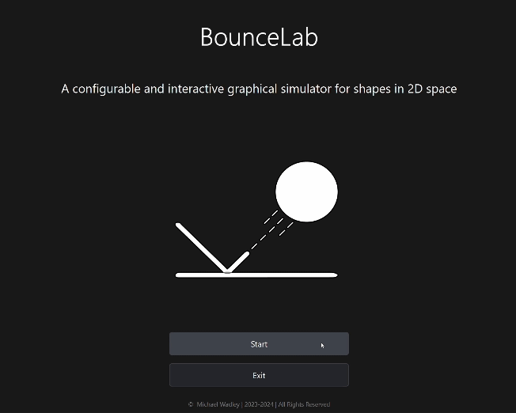

# BounceLab
### A configurable and interactive graphical simulator for various shapes in 2d physical space.    

  

  

# Features    
* Configurable Shapes
  * Shapes are randomly mixed by default, but can be overridden to circles, rectangles, or triangles.
    * Triangles are currently broken
    * More shapes are coming soon
  * Shape density and size are configurable within reasonable limits 
  * Support for up to 300 shapes
    * Optimizations coming soon for better performance with high shape counts.          
* Configurable Physics
  * Configurable world friction
  * Configurable gravity
  * Configurable world collision elasticity          
* Configurable Colors
  * Colors are random by default, but can be overridden for shapes and the background.          
* Keyboard Controls
  * Using the arrow keys will move all shapes in the direction of the pressed keys. The shapes will still be affected by all physical factors such as collision elasticity, shape size, and shape density, all of which may affect and/or limit control over the shapes.          
# Other Info
This program was implemented using QT and Box2D libraries in C++. It can be compiled using qmake or a program such as QT Creator. 
